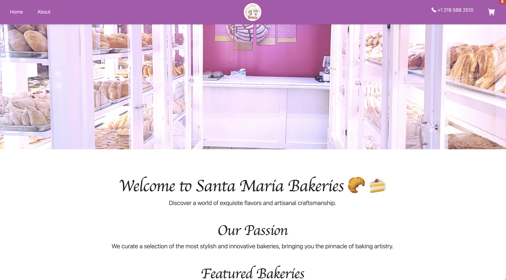
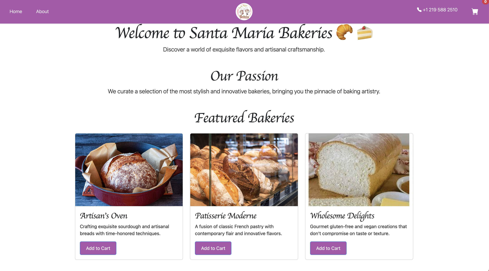
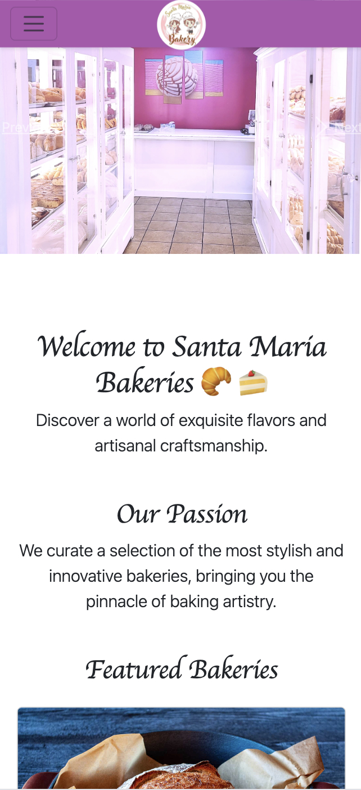
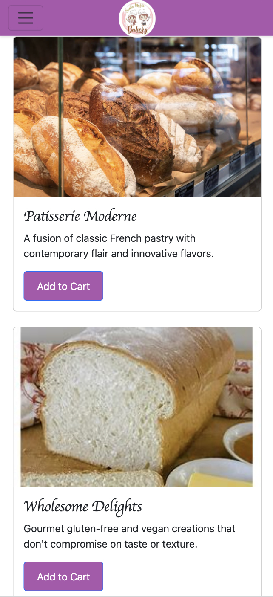

# Santa Maria Bakery Website

This is the repository of the **Santa Maria Bakery** website built with Angular.

## Current Implementation

### Completed:
- **Created the Angular project**: Initialized the Angular project and set up the structure for the bakery website.
- **Used Bootstrap for Styling**:
  - Applied Bootstrap to make the layout responsive and visually appealing.
- **Carousel**:
  - Implemented a responsive Bootstrap carousel that adapts well to mobile devices.
  - Ensured all images in the carousel are consistent in size across all slides.
- **Featured Bakery Section**:
  - Displayed bakery items with images, descriptions, and an "Add to Cart" button using Bootstrap cards.
    
## Screenshots of Progress:

### Laptop View:

### Mobile View:

### Things to be Implemented:
- **User Authentication**:
  - Add user login and registration functionality.
- **Database Integration**:
  - Use Database to store product and user information, including cart and order history.
- **Cart Functionality**:
  - Complete the functionality for adding items to the cart and updating the cart dynamically.
  - Implement real-time price calculation in the cart.
- **Pickup Order Placing**:
  - Need to implement the pickup order placement
- **Order Management**:
  - Implement the back-end to allow the bakery owner to manage incoming orders.
- **Mobile Optimization**:
  - Further optimize the UI/UX for mobile users.
- **Testing**:
  - Write unit tests and integration tests for the front-end components.
- **Deployment**:
  - Set up CI/CD pipelines and deploy the application to a cloud platform like Heroku or Netlify.
